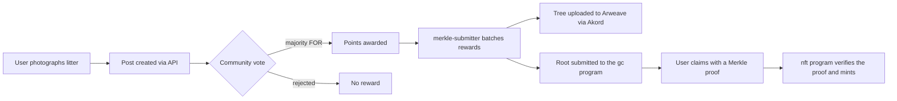

<p align="center">
  <a href="https://redduck.io">
    <picture>
      <source media="(prefers-color-scheme: dark)" srcset=".github/assets/redduck-logo-dark.svg">
      
    </picture>
  </a>
</p>

<h1 align="center">EcoSnap</h1>

<p align="center">
  <b>Pick up litter, snap a photo, earn points — verified by a community vote and settled on Solana.</b>
</p>

<p align="center">
  <a href="https://www.youtube.com/watch?v=nXz-NZ4Rjtc"></a>
  <a href="LICENSE"></a>
  <a href="https://solana.com/"></a>
  <a href="https://nestjs.com/"></a>
  <a href="https://turbo.build/repo"></a>
</p>

---

EcoSnap turns cleaning up your neighbourhood into an on-chain activity. You photograph the litter you collected, publish it as a post, and other users vote on whether it's genuine. Once a post passes the vote it earns points; points unlock achievement NFTs and can be spent on coupons in the in-app market. Group cleanups get their own events, with organizers, pass codes and boosted rewards.

The interesting part is how those rewards reach the chain. Writing every approved cleanup to Solana individually would be slow and expensive, so the backend batches them: it periodically builds a Merkle tree of everything earned since the last run, uploads the tree to permanent storage, and submits **only the root** on-chain. Users then claim their NFTs by presenting a Merkle proof, which the on-chain program verifies against that root.

## How it works



1. **Sign in with a wallet.** Authentication is a signed message: the API issues a nonce, the wallet signs it, and the backend verifies the signature with `tweetnacl` before returning a JWT. No passwords, no accounts.
2. **Post a cleanup.** Photos are uploaded through the API; the post records what was collected and its description.
3. **The community votes.** Users past the points threshold (1000) may vote. A post settles once the vote threshold (101 votes) is reached — with a majority in favour it is awarded `POINTS_PER_SUCCESS_FULL_GC` points.
4. **Rewards are batched.** The `merkle-submitter` worker picks up settled posts and unlocked achievements, builds a Merkle tree per batch, stores the full tree on Arweave (via Akord), and submits the root through the `gc` Anchor program.
5. **Claim on-chain.** The frontend fetches the user's proof from `/api/merkle/proof/:pubkey/:submissionId` and calls the `nft` program, which checks the proof against the stored root before minting a Token-2022 NFT.
6. **Spend the points.** The market exchanges points for coupons; cleanup events add participation rewards and achievement boosts on top.

## Repository layout

A [Turborepo](https://turbo.build/repo) monorepo on Yarn 1 workspaces.

```
apps/
├── frontend/
│   ├── web/                # React 18 + Vite dApp — feed, events, market, wallet auth
│   └── mobile/             # Expo / React Native shell (scaffolded, not implemented yet)
├── backend/
│   ├── api/                # NestJS REST API + Swagger — auth, posts, votes, events, coupons
│   └── merkle-submitter/   # NestJS worker — batches rewards, publishes Merkle roots on-chain
└── contracts/
    └── solana/             # Anchor workspace with two programs
        ├── programs/gc/    # Stores the Merkle roots submitted by the authority
        └── programs/nft/   # Mints Token-2022 achievement NFTs against a proof

packages/
├── database/
│   ├── common/             # Shared TypeORM base entities, decorators, module
│   └── gc/                 # Domain entities: User, GarbageCollect, DaoVote, CleanupEvent, Coupon, Merkle*
├── providers/              # Solana connection + Anchor program clients
├── storage/                # Akord (Arweave) file storage service
├── eslint-config/          # Shared ESLint configs (library / nest / next / react-internal)
├── prettier-config/        # Shared Prettier config
└── typescript-config/      # Shared tsconfig presets
```

### The two Solana programs

| Program | Address | Responsibility |
| --- | --- | --- |
| `gc` | `5Mew5NxqLr5NGG6VbHtkNNK6LNGa5ucKyuV6stWmfy16` | Holds global state and stores one Merkle root per submission (`new_root`), writable only by the configured authority |
| `nft` | `7PkvYFurAyci1hZFhkvfwHvMFZt9ctdpK8pogGNVizjm` | Creates the Token-2022 mint for an achievement — but only after verifying the caller's Merkle proof against a root stored by `gc` |

Splitting them this way keeps the trusted write path (roots, submitted by the backend authority) separate from the permissionless one (claims, submitted by users with a proof).

## Domain model

| Entity | What it represents |
| --- | --- |
| `User` | A wallet: points balance, voting rights, achievements, coupons |
| `GarbageCollect` | One cleanup post — photos, description, votes, points awarded |
| `DaoVote` | A signed FOR/AGAINST vote on a post |
| `CleanupEvent` | An organized group cleanup: city, dates, participant cap, admins, pass codes |
| `CleanupEventParticipation` | A user's participation in an event and its acceptance state |
| `Achievement` / `UserAchievement` | Unlockable achievements and per-user progress |
| `AchievementBoostReward` | Event-specific reward multipliers |
| `Coupon` / `UserCoupon` | Market items bought with points |
| `MerkleSubmission` / `MerkleProof` | A published batch (root + tree file) and the per-user proofs into it |

## Tech stack

| Area | Technology |
| --- | --- |
| Monorepo | Turborepo, Yarn 1 workspaces |
| Web | React 18, Vite, TypeScript, Tailwind CSS, Radix UI, TanStack Query, React Hook Form + Zod |
| Wallets | Solana Wallet Adapter, `@solana/web3.js`, `@coral-xyz/anchor` |
| Backend | NestJS 10, TypeORM, PostgreSQL, JWT, Swagger, `class-validator` |
| Contracts | Rust, Anchor 0.30, SPL Token-2022 |
| Storage | Akord (Arweave) for photos and Merkle tree files |
| Mobile | Expo, expo-router, React Native |

## Getting started

**Prerequisites:** Node.js 18+, Yarn 1.22, PostgreSQL. The contracts additionally need Rust, the Solana CLI and Anchor 0.30.

```bash
yarn install
```

### Environment

Both backend apps read `.env` from their own directory, falling back to the repo root. Copy the examples and fill them in:

```bash
cp apps/backend/api/.env.example apps/backend/api/.env
cp apps/backend/merkle-submitter/.env.example apps/backend/merkle-submitter/.env
```

| Variable | Used by | Meaning |
| --- | --- | --- |
| `DATABASE_URL` | api, submitter | PostgreSQL connection string |
| `AKORD_EMAIL` / `AKORD_PASSWORD` | api, submitter | Akord credentials for Arweave uploads |
| `JWT_AUTH_SECRET` | api | Secret used to sign access tokens |
| `JWT_EXPIRES_IN_S` | api | Token lifetime, in seconds |
| `POINTS_PER_SUCCESS_FULL_GC` | api | Points granted for a post that passes the vote |
| `PORT` / `API_PORT` | api | HTTP port (default `3002`) |

The web app validates its own environment with [`@t3-oss/env-core`](https://env.t3.gg/) — create `apps/frontend/web/.env`:

```bash
VITE_SOLANA_RPC_ENDPOINT=https://api.devnet.solana.com
VITE_BACKEND_URL=http://localhost:3002
```

### Running

```bash
yarn dev            # everything, through Turborepo
yarn dev:web        # just the web dApp
yarn run:api        # build + run the API (Swagger at /api/swagger)
yarn run:submitter  # build + run the Merkle submitter worker
```

### Contracts

```bash
cd apps/contracts/solana
anchor build
anchor test
yarn ts-node scripts/init.ts   # initializes global state for both programs
```

Anchor is deliberately kept out of the default build: the root `yarn build` excludes `solana-contracts`, so CI and app deployments don't need the Rust toolchain.

## Scripts

| Command | What it does |
| --- | --- |
| `yarn dev` | Run every app in watch mode |
| `yarn build` | Build all workspaces except the Solana contracts |
| `yarn build:all` | Build everything, contracts included |
| `yarn lint` | Lint every workspace |
| `yarn format` | Format every workspace with Prettier |
| `yarn build:api` / `yarn build:submitter` | Build a single backend app |

## Deployment

The backends are set up for Heroku: `heroku-postbuild` runs [`heroku-build.sh`](heroku-build.sh), which builds either the API or the submitter depending on the `BUILD_APP` environment variable (`api` or `submitter`). Deploy the same repository twice with a different `BUILD_APP` to get both services.

## License

[MIT](LICENSE) © RedDuck Limited
